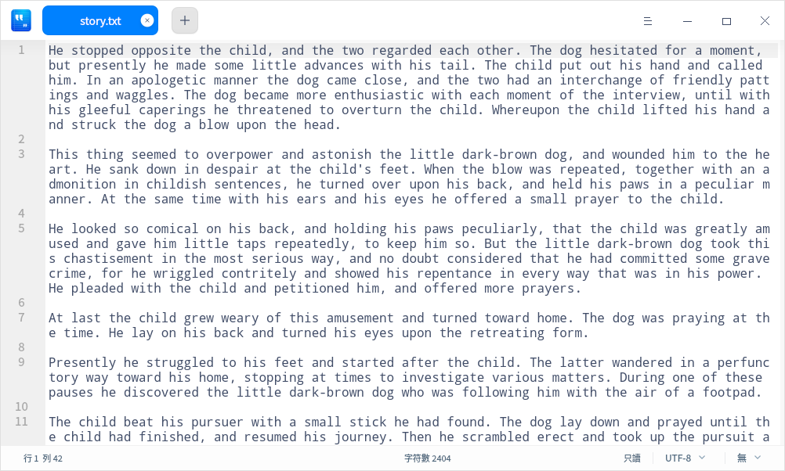
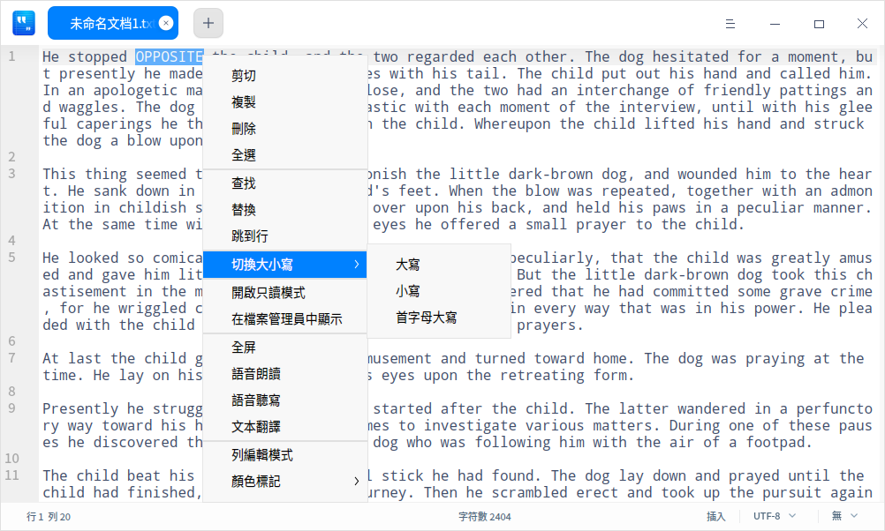
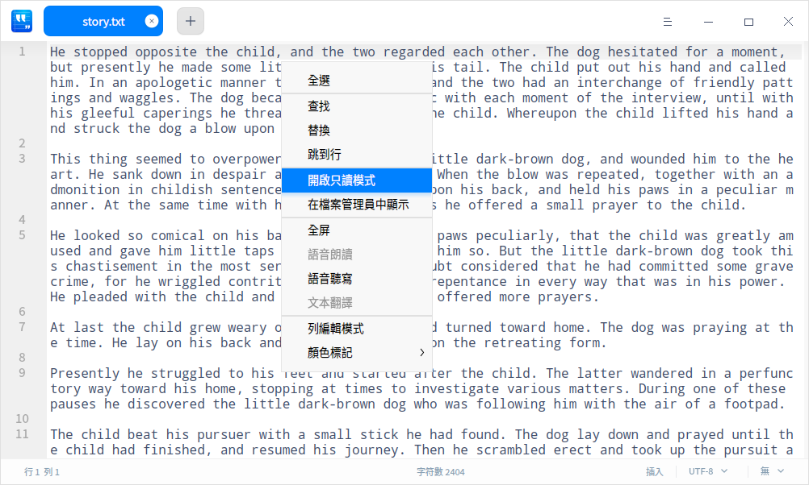
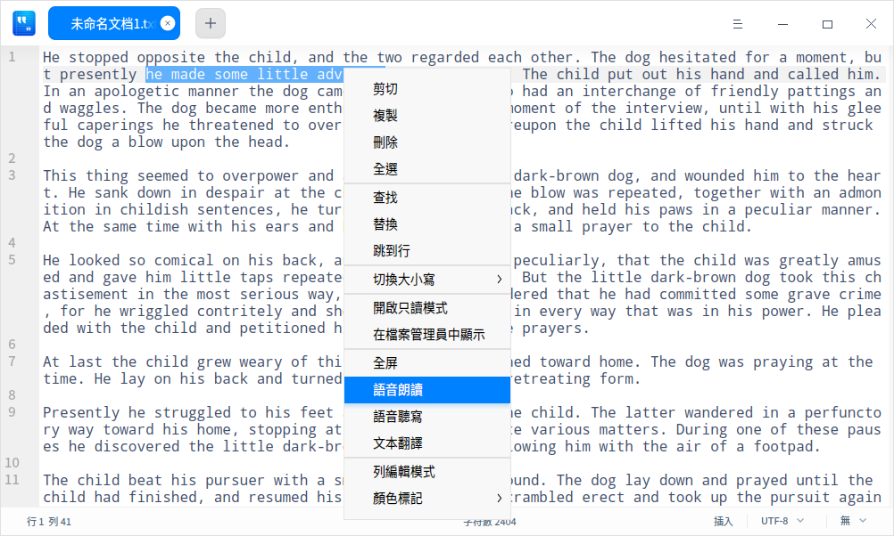

# 文本編輯器|deepin-editor|

## 概述

文本編輯器是一個簡單的文本編輯工具。您可以用它書寫簡單的文本文檔，也可以使用它的高級特性，讓它成為一個代碼編輯工具，支持代碼語法高亮。

## 使用入門

### 運行文本編輯器

1. 單擊任務欄上的啟動器圖標 ，進入啟動器界面。
2. 上下滾動鼠標滾輪瀏覽或通過搜索，找到文本編輯器圖標 ，單擊運行。
3. 右鍵單擊 ，您可以：

 - 單擊 **傳送到桌面**，在桌面創建快捷方式。
 - 單擊 **傳送到任務欄**，將應用程序固定到任務欄。
 - 單擊 **加至開機啟動**，將應用程序添加到開機啟動項，在電腦開機時自動運行該應用。

### 關閉文本編輯器

- 在文本編輯器界面，單擊 ，關閉文本編輯器。
- 在文本編輯器界面，單擊主菜單  > **退出** ，關閉文本編輯器。
- 在任務欄右鍵單擊 ，選擇 **關閉所有** ，關閉文本編輯器。

### 查看快捷鍵

在文本編輯器界面，使用快捷鍵 **Ctrl + Shift + ?** 打開快捷鍵預覽界面，您也可以在設置界面查看快捷鍵。熟練地使用快捷鍵，將大大提升您的操作效率。

## 基本操作

### 管理標籤頁

- 新建標籤頁/窗口

   - 單擊標籤頁上的按鈕  或  > **新標籤頁** 或使用快捷鍵 **Ctrl + T** 創建一個新的標籤頁。
   - 單擊  > **新窗口** 或使用快捷鍵 **Ctrl + N** 創建一個新的窗口。

- 調整標籤頁/窗口

   - 拖拽同一窗口內的標籤頁重新排序。
   - 滾動鼠標切換同一窗口內的標籤頁。
   - 移出標籤頁創建一個新的窗口，或者從一個窗口移到另外一個窗口中。

- 關閉標籤頁/窗口

   當窗口中僅有一個標籤頁時，關閉標籤頁的同時也會關閉窗口。
   - 使用快捷鍵 **Ctrl + W** 關閉當前標籤頁。
   - 單擊標籤頁上的  按鈕或者單擊鼠標中鍵，關閉當前標籤頁。
   - 右鍵單擊標籤頁，選擇 **關閉標籤頁** 、**關閉其他標籤頁** 或 **更多關閉方式** 來關閉標籤頁。

   > 說明：如果您的文件發生了變化而沒有保存，文本編輯器會在關閉前提示您保存更改。

### 打開文件

您可以採用以下方式打開一個或同時打開多個文本文件，選中的文件將會在新標籤頁中打開：

- 直接拖動文件到文本編輯器界面或其圖標上。
- 右鍵單擊文件，選擇 **打開方式** > **文本編輯器**。選擇文本編輯器為默認打開程序後，可直接雙擊打開。
- 在文本編輯器界面，單擊  > **打開文件** 或使用快捷鍵 **Ctrl + O**，在彈出的窗口中選擇文件打開。

### 保存文件
- 單擊  > **保存** 或使用快捷鍵 **Ctrl + S**，保存當前文件。
- 單擊  > **另存為** 或使用快捷鍵 **Ctrl + Shift + S**，另存當前文件。

### 打印文件

在文本編輯器中使用打印，需要您連接並配置好打印機。

1. 單擊  > **打印**，也可以使用快捷鍵 **Ctrl + P** 打開打印預覽。
2. 在打印預覽界面，您可以預覽文件，選擇打印機並設置打印頁面。
3. 在打印預覽界面，單擊 **高級設置**，可配置紙張大小、打印方式等相關參數。
4. 單擊 **打印** 即可將文件發送到打印機打印。

## 編輯文本

### 移動光標

除了使用方向鍵和鼠標單擊移動光標，您還可以使用以下快捷鍵迅速移動光標：

| 功能   |  快捷鍵 |
| --------------- | ------------ |
| 保存光標位置 | Ctrl + Shift + > |
| 重置光標位置（跳轉到上次光標保存的位置） | Ctrl + Shift + < |
| 右移一個詞 （光標向右跳過一個詞） | Ctrl + 右方向鍵 |
| 左移一個詞 （光標向左跳過一個詞） | Ctrl + 左方向鍵 |
| 移動到行尾 | End |
| 移動到行頭 | Home |
| 移動到文本結尾 | Ctrl + End |
| 移動到文本開頭 | Ctrl + Home |
| 移動到行縮進 | Ctrl + M |
| 向右匹配 （光標移動到右括號的後面） | Alt + P |
| 向左匹配（光標移動到左括號的前面） | Alt + N |

### 切換大小寫

切換大小寫功能可以將選中的文本全部改為大寫字母、小寫字母或者讓首字母大寫。

1. 選中待更改的文本內容。
2. 單擊右鍵，選擇 **切換大小寫**。
3. 選擇 **大寫**/**小寫**/**首字母大寫** 選項，更改會立即生效。

您也可以使用快捷鍵 **Alt + U/ L/ C** 迅速切換大小寫。

### 高亮文本

文本編輯器支持高亮不同類型的文本。
單擊底部狀態欄最右側的三角符號， 選擇某種文本類型。若文本中有相應內容則會自動高亮。

### 刪除文本
除了向左或向右逐個刪除字符外，您還可以使用以下快捷鍵迅速刪除字符：

| 功能   |  快捷鍵 |
| --------------- | ------------ |
| 刪除到行尾 | Ctrl + K |
| 刪除當前行 | Ctrl + Shift + K |
| 向左刪除一個詞 | Alt + Shift + N |
| 向右刪除一個詞 | Alt + Shift + M |

### 撤銷操作

如果在編輯文本時發生誤操作，可以使用快捷鍵 **Ctrl + Z** 撤銷操作，或者在右鍵菜單中選擇 **撤銷**。

### 查找文本

1. 單擊  > **查找** 或使用快捷鍵 **Ctrl + F** 打開查找窗口。
2. 在查找窗口中，輸入要搜索的文本。
3. 單擊 **下一個**、**上一個** 逐個查找，或使用 **Enter** 鍵查找下一個匹配項。
4. 按下 **Esc** 鍵或單擊關閉按鈕，關閉查找窗口。

> 竅門：選中一段文本後再進行搜索，則這段文本會自動出現在查找窗口中。

### 替換文本
1. 單擊  > **替換** 或使用快捷鍵 **Ctrl + H** 打開替換窗口。
2. 在替換窗口中，輸入要替換的文本以及新文本。
3. 單擊 **替換** 逐個替換，單擊 **剩餘替換**、**全部替換** 一次性替換剩餘的或所有的匹配文本。單擊 **跳過** 不替換當前匹配的文本。
4. 按下 **Esc** 鍵或單擊關閉按鈕，關閉搜索窗口。

### 跳到行
使用該功能可以迅速跳轉到任一行。
在右鍵菜單中選擇 **跳到行** 或者使用快捷鍵 **Ctrl + G** ，輸入行號即可跳轉到相應行。

### 編輯行

您可以使用以下快捷鍵迅速編輯行：

| 功能   |  快捷鍵 |
| ------------ | ------------ |
| 向上插入一行（在上方插入一行） | Ctrl + Enter |
| 向下插入一行（在下方插入一行） | Ctrl + Shift + Enter |
| 複製並黏貼當前行 | Ctrl + Shift + D |
| 上移一行（與上一行交換位置） | Ctrl + Shift + Up |
| 下移一行（與下一行交換位置） | Ctrl + Shift + Down |
| 向上滾動一行 | Super + Shift + Up |
| 向下滾動一行 | Super + Shift + Down |
| 設置標記 | Alt + H |
| 取消標記 | Alt + Shift + H |
| 複製行 | Super + C |
| 剪切行 | Super + X |
| 合併行 | Ctrl + J |

### 開啟/關閉只讀模式

1. 使用文本編輯器打開文檔，單擊右鍵，選擇 **開啟只讀模式**。
2. 在只讀模式下，單擊右鍵，選擇 **關閉只讀模式**。

### 語音朗讀

在 **控制中心 > 輔助功能** 中開啟語音朗讀、語音聽寫功能後，可以執行如下操作。

1. 單擊右鍵，選擇 **語音聽寫**，通過麥克風語音輸入後，轉譯文字將被編輯在文檔中
2. 選擇一段文字後，單擊右鍵，選擇 **語音朗讀**，語音播報選中的文字。

   > 說明：當未選擇文字時，右鍵菜單中 **語音朗讀** 不可啟動，處置灰狀態。

### 文本翻譯

在 **控制中心 > 輔助功能** 中開啟文本翻譯並選擇語言後，可以執行以下操作。

1. 在文本編輯器界面選擇一段文本後，單擊右鍵，選擇 **文本翻譯**，可將該段文本內容翻譯成目標語言。

### 列編輯

在文本編輯器界面，按住鍵盤上的 **Alt** 鍵不放，鼠標左鍵單擊多列啟動列編輯模式，為多行代碼同時編輯相同的內容，提高工作效率。

### 顏色標記

在文本編輯器界面，單擊鼠標右鍵選擇 **顏色標記**，在其下拉列表中進行選擇。

   - **設置標記**：對某一行或某一段文本內容添加顏色標記；有8種顏色按鈕可供選擇。
      + 將光標定在某一行，標記當前所在的行。
      + 選中一段文本內容後，標記選中的文本內容。
   - **標記所有**：將文本內容全部標記或對已選中的文本內容，在全文中標記匹配項；有8種顏色按鈕可供選擇。
      + 將光標定在任意一行，將文本內容全部標記。
      + 選中一段文本內容，在全文中標記匹配項。
   - **清除上次標記**：清除上次標記操作。
   - **清除所有標記**：清除當前所有標記。

### 書籤管理

在文本編輯器設置界面，勾選 **顯示書籤圖標** 後，您可以為任意一行的文本內容添加一個書籤。將鼠標指針移至左側欄任意行號前面會顯示圖標 ，添加成功後該行的書籤圖標會變為藍色填充的圖標 。

- 添加書籤

  + 鼠標左鍵單擊 ，為該行添加書籤。
  + 鼠標右鍵單擊 ，選擇 **添加書籤**，為該行添加一個書籤。
  + 將光標定在文本中任意一行，使用快捷鍵 **Ctrl + F2** 為該行添加一個書籤。

- 刪除書籤

  + 鼠標左鍵單擊已填充顏色的書籤圖標，直接刪除該行書籤。
  + 鼠標右鍵單擊已填充顏色的書籤圖標，選擇 **清除書籤**，刪除該行書籤。
  + 鼠標右鍵單擊書籤圖標，選擇 **清除所有書籤**，刪除該文本的全部書籤。

   >說明：鼠標移到左側行號前面才會顯示書籤圖標，移出書籤區域，書籤圖標消失。添加書籤後，該圖標一直顯示。 

### 注釋管理

在文本編輯器界面，您可對擴展名為.cpp 、.java 、.py等代碼類型的文件進行添加注釋的操作。
- 添加注釋
    + 選中一段文本內容，在右鍵菜單中選擇 **添加注釋**。
    + 選中一段文本內容，使用快捷鍵 **Alt + A** 添加注釋。
    
- 取消注釋
    + 選中一段已添加注釋的文本內容，在右鍵菜單中選擇 **取消注釋**。
    + 選中一段已添加注釋的文本內容，使用快捷鍵 **Alt + Z** 取消注釋。

   >說明：支持不同代碼語言的注釋，具體以實際為主。例如C，C#，Java注釋符號為 //，Python 注釋符號為 #。

## 主菜單

在主菜單中，您可以新建窗口、新建標籤頁、[查找文本](#查找文本)、[替換文本](#替換文本)、保存文件、切換窗口主題、查看幫助手冊，了解文本編輯器的更多訊息。
### 設置

您可以對基礎訊息、快捷鍵和高級訊息進行設置。

#### 基礎設置

1. 單擊 > **設置**。
2. 在基礎設置選項，您可以選擇：
 - 設置字體樣式和字號大小。
 - 勾選 **自動換行**，在編輯區自動換行。
 - 勾選 **顯示代碼摺疊標誌**，在左側欄顯示 或者按鈕，右鍵單擊按鈕選擇摺疊/展開當前層次或所有層次。
 - 勾選 **顯示行號**，在左側欄顯示行號。
 - 勾選 **當前行高亮**，光標所在的行高亮顯示。
 - 勾選 **顯示書籤圖標**，在左側欄顯示書籤圖標。
 - 勾選 **顯示空白制符/製表符**，顯示文本中的空白字符和製表符，您也可手動輸入或刪除空白字符和製表符。

   > 竅門：您還可以使用 **Ctrl + 「+」/ 「-」** 來調節文本編輯器的默認字號。使用 **Ctrl + 0** 恢復默認字號。

#### 快捷鍵設置

1. 單擊> **設置**，在 **快捷鍵** 選項查看當前快捷鍵。
2. 選擇一種快捷鍵映射。
3. 單擊快捷鍵編輯框 ，可以自定義快捷鍵。

   > 說明: 快捷鍵映射允許您選擇某一種鍵盤快捷鍵。您可以使用標準快捷鍵，Emacs快捷鍵，或自定義快捷鍵，以符合您的使用習慣。

#### 高級設置

1. 單擊  >**設置**。
2. 在 **高級設置** 選項，您可以設置：
   - 窗口狀態：正常窗口，最大化或全螢幕。
   - Tab字符寬度：Tab縮進所佔用的空間大小。

### 主題

窗口主題包含淺色主題、深色主題和系統主題。

1. 在文本編輯器界面，單擊 。
2. 單擊 **主題**，選擇一個主題顏色。

### 幫助

查看幫助手冊，進一步了解和使用文本編輯器。

1. 在文本編輯器界面，單擊 。
2. 單擊 **幫助**。
3. 查看文本編輯器的幫助手冊。

### 關於

1. 在文本編輯器界面，單擊 。
2. 單擊 **關於**。
3. 查看文本編輯器的版本和介紹。

### 退出

1. 在文本編輯器界面，單擊 。
2. 單擊 **退出**。